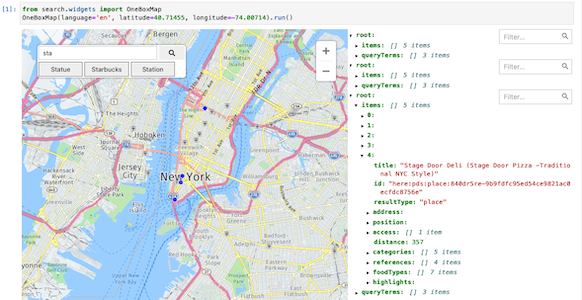

# Search Notebook

A jupyter notebook demonstrating the use of HERE Geocoding & Search endpoints `/autosuggest`,  `/discover`, `/lookup`, `/revgeocode`,  and `/signals`.



    
<code>API_KEY="[your api key](https://developer.here.com/documentation/geocoding-search-api/dev_guide/topics/quick-start-dhc.html#get-an-api-key)" here-search-notebook</code>

## Installation

    $ pip -v install here-search-demo --extra-index-url https://artifactory.in.here.com/artifactory/api/pypi/onesearch-pypi/simple


### step-by-step for non developers

This simplified method does not use pyenv or conda, but the python3 integrated `venv` module.
The recipe below runs on a macos Monterey machine.

1. Get A HERE [API key](https://developer.here.com/documentation/geocoding-search-api/dev_guide/topics/quick-start-dhc.html#get-an-api-key)

2. Do:

   ```
   mkdir virtualenv
   python3 -m venv virtualenv
   source virtualenv/bin/activate
   pip3 -v install git+ssh://git@main.gitlab.in.here.com:3389/olp/onesearch/playground/decitre/search-notebook.git#egg=here-search
   jupyter nbextension enable --py widgetsnbextension
   jupyter labextension install @jupyterlab/geojson-extension
   python3 -m ipykernel install --user --name search_notebook --display-name "demo search"
   ```

3. Run the demo in your virtualenv

   ```
   cd search-notebook
   source virtualenv/bin/activate
   API_KEY="your api key" here-search-notebook
   ```


## Reference

- [HERE Geocoding & Search](https://developer.here.com/documentation/geocoding-search-api/dev_guide/index.html)
- [here_map_widget](https://here-map-widget-for-jupyter.readthedocs.io/en/latest/index.html)
- [ipywidgets](https://ipywidgets.readthedocs.io/en/latest/index.html)
- [asyncio](https://bbc.github.io/cloudfit-public-docs/asyncio/asyncio-part-1)
- [Effective Python environment](https://realpython.com/effective-python-environment/)
- [Launch your OSS](https://opensource.guide/starting-a-project/#launching-your-own-open-source-project)
- [GeoJS terms of services](https://www.geojs.io/tos/)
- [Macos extended charset](https://www.barcodefaq.com/knowledge-base/mac-extended-ascii-character-chart/)