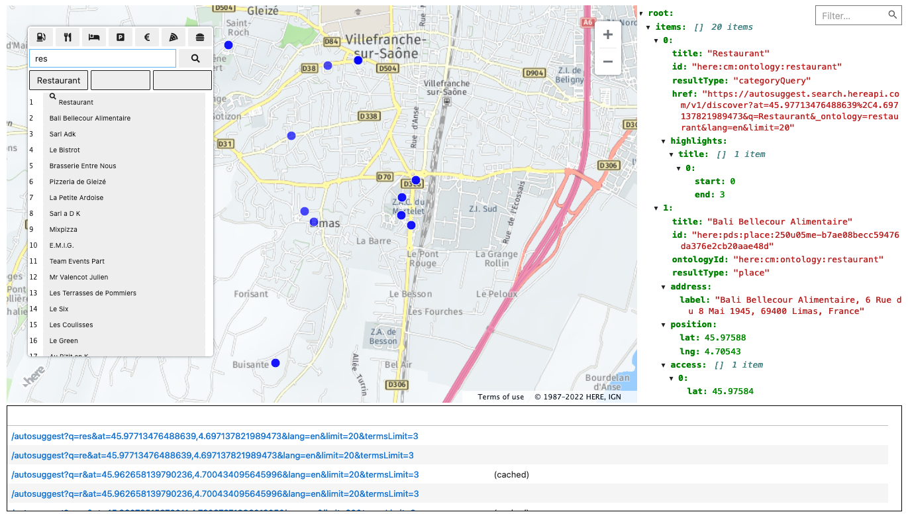

[](https://github.com/heremaps/here-search-demo/actions/workflows/test.yml)

# HERE Search notebooks

A set of jupyter notebooks demonstrating the use of HERE Geocoding & Search endpoints `/autosuggest`,  `/discover`, `/browse`, and `/lookup`.



Requirements: a [HERE API key][1] and a Python environment.

Try the latest build [in your browser](https://main.gitlab.in.here.com/olp/onesearch/playground/decitre/search-notebook-ext/-/jobs/artifacts/master/browse?job=pages).

## Installation

Run preferably in a virtual environment:

   ```
   pip install '.[lab]'
   ```

Link the virtual environment to a IPython kernel:

   ```
   python -m ipykernel install \
     --prefix $(python -c "import sys; print(sys.prefix)") \
     --name search_demo --display-name "search demo"
   ```

## Usage

   ```
   API_KEY="your API key" here-search-notebooks
   ```
   
(More [details][2])

[1]: https://developer.here.com/documentation/geocoding-search-api/dev_guide/topics/quick-start-dhc.html#get-an-api-key
[2]: docs/developers.md#setup-a-notebook-python-environment
