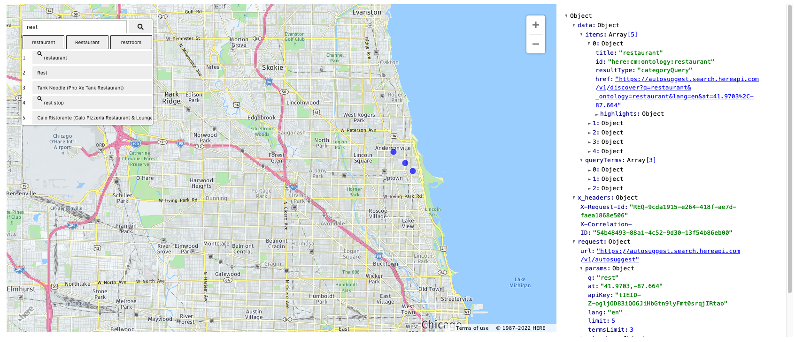

# Search Notebook

A jupyter notebook demonstrating the use of HERE Geocoding & Search endpoints `/autosuggest`,  `/discover`, `/lookup`, `/revgeocode`,  and `/signals`.



To use it, you need a [HERE API key](https://developer.here.com/documentation/geocoding-search-api/dev_guide/topics/quick-start-dhc.html#get-an-api-key) and either: 
- either a Python environment
- or a running Docker Desktop

## Python

1. Install the Python package

   ```
   $ pip -v install here-search-demo --extra-index-url https://artifactory.in.here.com/artifactory/api/pypi/onesearch-pypi/simple
   ```

1. Launch the notebook

   ```
   $ API_KEY="your API key" here-search-notebook
   ```
   
(More [details](docs/developers.md#setup-a-notebook-python-environment))

## Docker

1. Pull the latest image

   ```
   $ docker pull docker-local.artifactory.in.here.com/onesearch-demo:latest
   ```
2. Run a new container

Use the Docker Desktop to run the image with the host port `51234` and the variable `API_KEY` set to your key.
Or do:

   ```
   $ docker run -p 51234:8888 -e APY_KEY=<your API key> docker-local.artifactory.in.here.com/onesearch-demo:latest
   ```

3. Browse to the notebook

Browse to `http://127.0.0.1:51236/lab/tree/oneboxmap.ipynb`

The Jupyter token can be found at the end of the running container logs.
